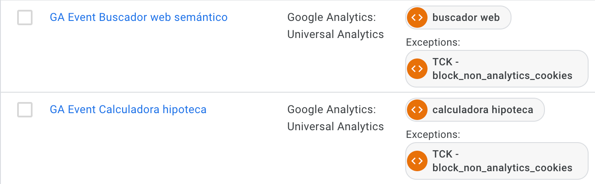
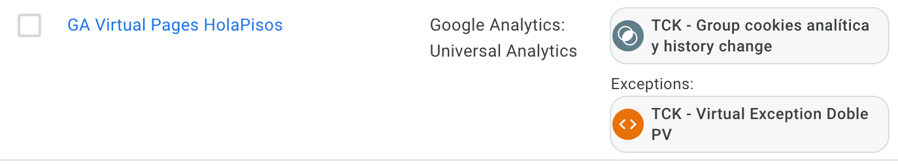

La idea de este repositorio es ordenar y mantener toda la documentación necesaria para el departamento de Analytics Engineering. Dentro del mismo vamos a encontrarnos diferentes apartados, que podemos dividir en: protocolos/procedimientos,  documentación, productos y formaciones.


# Overview

* [Protocolos](#Protocolos)
  * [Nomenclaturas](#Nomenclaturas)
  * [Buenas prácticas](#Buenas-prácticas)
  * [Tareas](#Tareas)

* [Documentación](#Documentación)

* [Productos](#Productos)

* [Contenedores](#Contenedores)

## Protocolos

Dentro de esta sección queremos recopilar todos los procedimientos que podemos estandarizar a la hora de trabajar como equipo. Esto nos ayudará a ser más eficientes y tener una visión más global de lo que cada miembro del equipo está realizando:

### Nomenclaturas

Las nomenclaturas estandarizadas nos sirven para entender rápidamente el trabajo realizado y para dar mayor robustez a las implementaciones que realicemos. En este sentido, podemos hablar de nomenclaturas para diferentes procesos, pero vamos a centrarnos en lo que la mayoría de nosotros va a trabajar conjuntamente: los gestores de etiquetas. Por consenso, se ha adjudicado como la forma a utilizar la siguiente:

```
TCK - Utilidad_Nombre_Especificaciones
```

Esto serviría tanto para Tags, triggers y variables que podamos crear. Por ejemplo, si tenemos que crear una tag  Google Analytics de pageview sólo para la página de blog de nuestra web, la nomenclatura sería:

```
TCK - Pageview_Analytics_Blog
```

Por supuesto, pueden venir casos más complicados, pero preferiblemente nos mantendremos en este formato siempre que sea posible. Si lo hacemos así nos será mucho más fácil auditar trabajos de compañeros o entrar a mitad de un proyecto si se necesita ayuda de cualquier tipo.

### Buenas prácticas

Dentro de un campo que tiene sus fronteras tan poco delimitadas como el nuestro, imponer unas formas de trabajo que abarquen todo quizá sea algo ambicioso, pero lo que sí podemos hacer es marcar unas pbuenas prácticas para lo que puede representar el grueso de nuestro trabajo. Como ya hemos indicado anteriormente, nos referimos a los gestores de etiquetas. Siguiendo las recomendaciones de [Katie Hempenius de Google sobre esto](https://web.dev/tag-best-practices/) las podemos resumir en:

  - Tags: el orden de prioridad a la hora de implementar Tags SIEMPRE será el siguiente:
    - Plantillas.
    - Pixels (imagen)
    - Si no queda más remedio: Custom HTML
  Tal y como explica en mayor profundidad la autora, la carga de Custom HTML a través de un gestor de etiquetas puede provocar efectos adversos a la web en la que lo estamos implementado, desde caída de rendimiento hasta posibles roturas de partes de la web. Es por ello que recomienda utilizar como primera opción las Custom templates. En este sentido, hay una gran variedad de plantillas ya creadas en la mayoría de gestores de etiquetas, siendo el caso de GTM el más curioso ya que la mayoría las ha cubierto la comunidad. Siempre que sea posible utilizar esta opción, será nuestra preferida.

  - Triggers: esta regla es más sencilla que la anterior: procuremos utilizar triggers que salten específicamente para el evento/página que queremos trackear.

  En este apartado es muy importante poder entender los procesos que ha seguido un compañero. Por ello, debemos evitar en la medida de lo posible los grupos de triggers o las configuraciones opacas que tengan poco nivel de visualización. Por ejemplo, para la configuración de un CMP a través de GTM por ejemplo, es mucho mejor seguir las pautas estándar de este proceso: trigger de acción del evento (cuando queremos trackear X) y bloqueador si esas cookies no se han aceptado. Algo como esto:

  

  Gracias a esta configuración es muy fácil entender dónde tiene que saltar esta etiqueta y cuándo se va a bloquear. En cambio, si hacemos algo como esto:

  

  Vemos que es mucho más difícil entender el proceso que está siguiendo esta etiqueta. Esto nos llevaría a un mayor tiempo de debuggeo o de reconfiguración si fuera el caso.

  - DataLayer: siempre vamos a querer trabajar con inyección de datos en el DataLayer y nuestra forma preferida de hacerlo va a ser que esto se inyecte desde el propio código de la web. ¿Por qué? Por dos razones fundamentales:
    - Facilita nuestro trabajo al poder estandarizar procesos en pocas tareas que le daremos a nuestro gestor de etiquetas.
    - Si se carga el DataLayer desde la propia web estamos dejando que el gestor actúe de una manera mucho más limpia y robusta que si lo inyectáramos desde el propio gestor. Esto ocurre porque así el gestor sólo actúa como "escuchador" y sólo se debe encargar de recoger información y mandarla a las plataformas correspondientes.

  - Contenedores: en la medida de lo posible, utilizaremos un contenedor por página.

  - Auditado: convenimos emplear 1h quincenalmente para revisar nuestras cuentas y eliminar todo aquello que no se esté utilizando y que genere ruido en la configuración del contenedor.

  - Versiones: SIEMPRE que publiquemos una versión deberemos especificar con la mayor claridad todo lo que hemos hecho en esa versión, aunque ese cambio pueda parecer nimio en el instante de publicación. Esto nos facilitará mucho posibles reverts o debbgueos en un futuro cuando no nos acordemos de lo que ocurrió en esa cuenta o si la persona que lo hizo ya no se encuentra entre nosotros.

### Tareas

Las tareas que vamos a ejecutar deben de tener un tiempo determinado, una prioridad determinada y un scope determinado. Si tenemos esta información nos será mucho más fácil organizarnos, hacer las tareas prioritarias y tener una visión más global de por qué estamos realizando la tarea correspondiente. Para ayudar a que esto se cumpla y tengamos toda esta información se creará un tablón en Trello en el que deberemos contar con la siguiente información por tarea:

    - Responsable que solicita la tarea
    - Persona que debe ejecutar la tarea
    - Tiempo estimado de la tarea
    - Deadline
    - Scope del proyecto
    - Prioridad (baja, media, alta y tuvidadependedeesto)
    - Dependencias (de otros departamentos, del cliente...)

## Documentación

En este apartado iremos recopilando toda la documentación que se genere en el departamento, desde guías de etiquetado hasta posibles presentaciones o manuales de instrucciones.

- [Santalucía Onetrust](https://docs.google.com/document/d/16SKGyudFrgsToVSgZD8xqE9vG1tIoPNqm69UG5IXYDw/edit?usp=sharing)
- [DebugView Firebase](https://docs.google.com/document/d/1mPV0WpJpU5qGtkwNUFjYdqqdVS5kh8lTHzNs9wtZQYQ/edit)
- [GTM Tools](https://docs.google.com/document/d/123zOUyPTrNUOz8zqLzzqzndBiNTk-NfPDA4uxV_td8U/edit)
- [Pixel con Element Visibility](https://docs.google.com/document/d/13sIwytDJNxYf17BiniNO2lB6c8qS3ysUPftB4v5IeFc/edit)
- [Data Control Google](https://docs.google.com/presentation/d/1rFkjWbtRKW-O5YesDi8BkETQVfAovAOdGTjtmbXd8uU/edit#slide=id.p)
- [Tealium vs GTM](https://docs.google.com/presentation/d/1szEAKpR4aq1bccjc-pzguYfBoOqcWHWAnCLgThJc2xo/edit#slide=id.p)
- [Git Tutorial](https://docs.google.com/presentation/d/1z0yO-IqIjr9oAJePQnQ7Uq0DWea0Zhoumt4eLUkZknE/edit#slide=id.p)
- [Carpeta Miscelánea AE](https://drive.google.com/drive/folders/1kt19vExFgzhD0KdoPCYD7fnLhx1j9LCi)
- [Guía para usar gitlab + git](https://docs.google.com/document/d/1NcVQJck9GrctU-YSSi2AmaZc9cURl6iRrbjanRzyeTM/edit?usp=sharing)
- [Parámetros dinámicos en GA4](https://docs.google.com/document/d/1yemC1DitG0t_9Piy1SqLb75uD_jZ6pVd/edit)
- [Añadir parámetros a eventos nativos en GA4](https://docs.google.com/document/d/11dygn8zZQPjYAx0oXA19MSIX8Ug0XiHV24xI-RohBr0/edit)

## Documentación Vodafone
En este apartado podemos encontrar toda la información relativa a la cuenta de vodafone.
- MVA : Mi Vodafone APP
  - Flujos
    - [Flujos transaccional](https://docs.google.com/presentation/d/1PKsfTogtnbZzf9zIS3MTSwiLYjoQVworbJCs-QNPU10/edit#slide=id.ged43129fa2_0_0)
  - Usuarios
    - [Usuarios de pruebas](https://docs.google.com/spreadsheets/d/11hwLBST6pFBc8-buM8UxEEBIrt-nJxdfHErTD85Tbiw/edit?pli=1#gid=718938017)

## Productos & Procesos

Este es un apartado para almacenar todos los productos existentes para el departamento y los procesos que debemos seguir a la hora de estandarizarlos. Esto nos ayudará a visualizar cuáles son nuestras mayores fortalezas y dónde podemos crecer más según la dirección del equipo. Podemos votar por nuevos productos para ir incluyéndolos en la lista.

- Implementación Analítica TMS:
  - [Instalación TMS](https://docs.google.com/document/d/1oaJvQKUKem3HQMs5rVFH2Zf187ZkAj6xKXf_oMDkTgE/edit#heading=h.iehy7iscg38g)
    - [Tealium](https://docs.google.com/document/d/1oaJvQKUKem3HQMs5rVFH2Zf187ZkAj6xKXf_oMDkTgE/edit#heading=h.9e5d32id9npi)
    - [GTM](https://docs.google.com/document/d/1oaJvQKUKem3HQMs5rVFH2Zf187ZkAj6xKXf_oMDkTgE/edit#heading=h.ystws0eld20w)
    - [Ownership](https://docs.google.com/document/d/1oaJvQKUKem3HQMs5rVFH2Zf187ZkAj6xKXf_oMDkTgE/edit#heading=h.rqntlolg0p66)
  - [Implementación Soluciones desde TMS](https://docs.google.com/document/d/1oaJvQKUKem3HQMs5rVFH2Zf187ZkAj6xKXf_oMDkTgE/edit#heading=h.gmythbmpu34n)
    - [GA4 en Tealium](https://docs.google.com/document/d/1oaJvQKUKem3HQMs5rVFH2Zf187ZkAj6xKXf_oMDkTgE/edit#heading=h.wrtpobgy1o7i)
    - [GA4 en GTM](https://docs.google.com/document/d/1oaJvQKUKem3HQMs5rVFH2Zf187ZkAj6xKXf_oMDkTgE/edit#heading=h.chq9z71g1kes)
    - [Arquitectura en GA4](https://docs.google.com/document/d/1oaJvQKUKem3HQMs5rVFH2Zf187ZkAj6xKXf_oMDkTgE/edit#heading=h.wmgkevwodep5)
  - [Implementación Analítica en APP](https://docs.google.com/document/d/1oaJvQKUKem3HQMs5rVFH2Zf187ZkAj6xKXf_oMDkTgE/edit#heading=h.ri0j52s4lq0v)
    - [Vinculación Firebase - GA4](https://docs.google.com/document/d/1oaJvQKUKem3HQMs5rVFH2Zf187ZkAj6xKXf_oMDkTgE/edit#heading=h.m4mkngmncpma)
    - [Custom Analytics](https://docs.google.com/document/d/1oaJvQKUKem3HQMs5rVFH2Zf187ZkAj6xKXf_oMDkTgE/edit#heading=h.s72wk2d00wd7)
    - [Debugging App](https://docs.google.com/document/d/1oaJvQKUKem3HQMs5rVFH2Zf187ZkAj6xKXf_oMDkTgE/edit#heading=h.w9ly0u7rdn76)
    - [Ownership](https://docs.google.com/document/d/1oaJvQKUKem3HQMs5rVFH2Zf187ZkAj6xKXf_oMDkTgE/edit#)

- Estrategia de Medición (aunque las parte de objetivos y KPIs normalmente las realizará un analista, debemos entender todo esto para tener claro el proceso que vamos a seguir para recolectar los datos):
  - [Estandarización de eventos multiplataforma](https://docs.google.com/document/d/1kxRtTIBrjQY1_q5LqopOs2NwcbvmhoBwqgLmZUo8B-k/edit#heading=h.86oc3en9e5os)

- Implementación CMP (OneTrust, Cookiebot):
  - [Requisitos Legales](https://docs.google.com/document/d/1K-7rIq3cjYT0My1VRwVxknpR9d6SHea1AlCk5nlUc3g/edit#heading=h.kz9rdpob0w16)
  - [Instalar y Configurar CMP (OneTrust en este caso)](https://docs.google.com/document/d/1K-7rIq3cjYT0My1VRwVxknpR9d6SHea1AlCk5nlUc3g/edit#heading=h.tj3hfce3k5p0)
  - [Tipos de Script](https://docs.google.com/document/d/1K-7rIq3cjYT0My1VRwVxknpR9d6SHea1AlCk5nlUc3g/edit#heading=h.ja4wyzoqi73i)
  - [Configuración de TMS para CMP](https://docs.google.com/document/d/1K-7rIq3cjYT0My1VRwVxknpR9d6SHea1AlCk5nlUc3g/edit#heading=h.t6bn038yqvdz)
  - [Ownership](https://docs.google.com/document/d/1K-7rIq3cjYT0My1VRwVxknpR9d6SHea1AlCk5nlUc3g/edit#heading=h.5g5665xeblfh)
- Implementación Consent Mode & Enhanced conversions

- Server-Side Tagging
  - [Server-side GTM for FB Conversions API](https://docs.google.com/document/d/1qm1jo6eUeWbCqAVk1a01jdA0KdotH2VIYSiEEm_dkEc/edit)
  - [Tealium EventStream for FB Conversions API](https://docs.google.com/document/d/17G0JxodREYiEwNFNRCo-NH1BgdPJUXNmXyeX2LEvgVs/edit#heading=h.r15puvh8i317)


## Contenedores

Para tener agrupados todos los esfuerzos que vayamos haciendo como equipo, tenemos (de momento) 5 contenedores dentro de la cuenta de data en GTM con diferentes configuraciones que nos servirán como plantilla para siguientes proyectos. Estos son:

- Forms: todo lo relacionado con form listeners (pardot, hubspot, etc.)
- Onetrust Config: contenedor plantilla con todos los elementos necesarios para realizar la configuración de OneTrust y Consent Mode.
- Pixels: desarrollos de plantillas de pixels que podamos haber realizado.
- Server-Side: tests
- UTMs: plantillas relacionadas con la atribución de campañas por UTMs.
