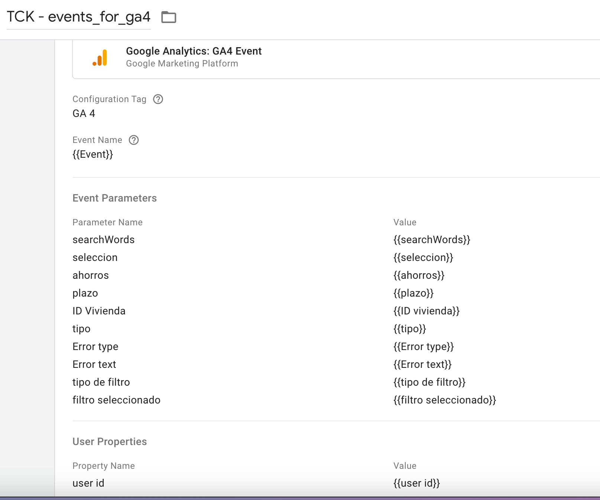

Dentro de este documento vamos a recoger todos los procedimientos que hemos seguido a la hora de crear guías de etiquetado para Google Analytics 4, así como los procesos internos que hayamos podido realizar para adaptar los eventos de Universal a GA4. En este sentido nos hemos encontrado con 4 escenarios que podemos diferenciar y de los que hablaremos aquí.


# Overview

* [Escenarios](#Escenarios)
  * [Cliente GTM - no dataLayer](#Cliente-GTM)
  * [Cliente dataLayer - Adaptación](#Cliente-Adaptacion)
  * [Cliente dataLayer de 0](#Cliente-dataLayer)
  * [Cliente APP](#Cliente-APP)

* [Documentación](#Documentación)


## Escenarios
  Aquí nos encontramos con los diferentes escenarios que vamos a trabajar. Son modelos ideales y por supuesto, sufrirán modificaciones en la realidad, pero nos podemos basar en ellos para nuestra aproximación al trabajo a realizar.

### Cliente GTM

### Cliente Adaptacion

En este escenario ya tenemos un dataLayer bien definido en la página para la estructura de Universal. Aprovechando esto y las funcionalidades que nos permite GTM, lo que planteamos es realizar una adaptación de lo que ya existe para que cuadre con la nueva estructura de datos en GA4. Por supuesto, y como ya hemos adelantado antes, la realidad siempre supera los modelos. Una vez nos introducimos de lleno en lo que ocurre en la página y cómo está estructurado el dataLayer, nos encontramos con lo siguiente:

  - **Eventos integrados dentro del clásico gaEvent**. Estos eventos son los típicos que ya conocemos, tienen el gaEvent como nombre de evento para que actúe de trigger en cada una de las interacciones y la información relevante se integra dentro de las variables que estructuran los eventos en universal: category, action y label.

  - **Eventos específicos alternativos**. Parece que dentro de la estructura del dataLayer se decidió en algún momento que se debían utilizar eventos para interacciones específicas (principalmente objetivos de negocio), aunque el gaEvent también estuviera actuando en ellas. Aquí un ejemplo:

  

  Siguiendo lo que se ha ido haciendo en este sentido, nos encontramos con los siguientes eventos (dentro de cada evento hemos especificado qué parámetros se estaban enviando a Analytics):

    - Buscador predictivo
      - searchWords
      - seleccion
    - Buscador web
      - searchWords
      - seleccion
    - Calculadora hipoteca
      - ahorros
      - plazo
    - Contacto_ID
      - ID vivienda
      - tipo
    - Error login
      - Error type
      - Error text
    - Error Registro
      - Error type
      - Error text
    - Filtro
      - tipo de filtro
      - filtro seleccionado
    - Formulario contacta
    - form financiacion
    - Login web
      - user id
    - Recuperar contraseña
      - user id
    - Registro
      - user id

  - **Eventos Ecommerce**. Configuración estándar de enhanced ecommerce para universal.

Debido al hecho de encontrarnos con los eventos alternativos, la idea inicial de adaptación cambia ligeramente y nos proponemos hacer lo siguiente: lanzar esos eventos tal y como están a GA4, ya que engloban la totalidad de los eventos objetivo, mantener la estructura de gaEvent tal y como está para no perder el trackeo de interacciones (siempre podemos crear los eventos que necesitemos dentro de GA4 una vez recogidos) y, por último, intentar la adaptación de los eventos ecommerce a la estructura actual de GA4. Vamos a ver cómo hemos organizado cada uno de estos procesos.

  * Eventos Objetivo. Sabiendo que estos eventos existían en el dataLayer ha facilitado mucho la adaptación a GA4, ya que son específicamente el tipo de eventos que necesitamos enviar a Analytics. Las dos casuísticas que teníamos que resolver eran, por un lado, cómo unificábamos toda la info en una tag y, por otro, cómo hacíamos que saltara esa tag con cada uno de los eventos. La segunda era la más sencilla de solucionar, ya que simplemente teníamos que añadir en un mismo trigger todos los eventos que componen esta estructura de eventos "alternativos". Lo hacemos de la siguiente forma:

  

  Por otro lado, teníamos que integrar toda la información en una sola tag para poder tener todo unificado y que, además, se lanzara de forma dinámica cada evento. Sabiendo que los parámetros sólo se completan una vez están populados en el DataLayer, la opción que hemos pensado que engloba toda esta información es la siguiente:

  

  De esta manera, lo que conseguimos es tener un evento dinámico que coge el nombre que necesitamos para GA4 y, además, generar los parámetros asociados a cada uno de estos eventos.

  * Evento gaEvent. La configuración de este evento la usamos más como un backup de todas las interacciones de los usuarios, para no perder lo que ya teníamos en Universal. Para ello, podemos seguir utilizando el trigger de custom event "gaEvent" y dejar la configuración de la etiqueta de la siguiente manera:

  

  Lo diferente que hemos hecho aquí ha sido limpiar la estructura de los propios parámetros, ya que tal y como estaba hasta ahora nos podía suponer problemas a la hora de analizarlo con una BBDD como BigQuery. Como se puede observar en la configuración, lo que hemos hecho ha sido crear unas variables de javaScript con las que limpiar estos parámetros, siguiendo esta lógica:
  ```bash
    function(){
      var category = {{TCK - Var - eventCategory}};
      var category_with_no_colon = category.replace("::", '_');
      var category_with_no_colon_nor_spaces = category_with_no_colon.replace(/\s/g, '_');
      return category_with_no_colon_nor_spaces
    }
  ```
  Con esto nos aseguramos que no existan ni espacios ni dobles puntos extraños que luego puedan dificultar el análisis. Por último, en la variable marcaremos que siempre cambie Case por Lowercase para no tener mayúsculas.

  * Ecommerce. Este punto realmente lo he trabajado por tener una opción que podamos utilizar siempre y que no dependa de IT, por ser lo más ágiles posible. En cualquier caso, la buena práctica aquí sería introducir un nuevo código de implementación de ecommerce adaptado a las necesidades de GA4.

  Para este punto lo que he hecho ha sido aprovecharme de una plantilla que hace prácticamente todo el trabajo por nosotros. Es una plantilla de variable llamada "GA Enhanced Ecommerce to GA4 Ecommerce Converter" (el nombre lo dice todo). Para poder utilizar debidamente esta plantilla, tenemos que integrarla dos veces. Una con la siguiente configuración:

  

  Y otra con esta:

  

  Como véis, la configuración es exactamente la misma salvo por el tipo de información que vamos a recoger: en un caso son los objetos del ecommerce (los items y todo lo relacionado), en el otro son los eventos. Gracias a estas variables podemos luego realizar la configuración de una tag unificada para ecommerce que se quedaría de la siguiente manera:

  

  Así se lanzarían los eventos con el nombre de evento que corresponde al ecommerce de GA4 y, por otro lado, se cargarían los items tal y como necesitamos.

  Por supuesto, toda esta configuración no deja de ser un beta, con el que iremos viendo si tiene sentido añadir o quitar elementos que la transfiguren.


### Cliente dataLayer

### Cliente APP

## Documentación Externa

  - [Event Parameters in deep](https://stuifbergen.com/2022/01/making-sense-of-event-parameters-in-ga4/)
  - [Implementation Guide - Simo](https://www.simoahava.com/analytics/implementation-guide-events-google-analytics-4/)
  - [Best Practices to create events - Ken Williams](https://ken-williams.com/guide/installation/5-best-practices-for-creating-your-events-and-parameters-in-a-google-analytics-4/)
  - [Modeled Conversion ga4](https://ken-williams.com/guide/overview/how-conversions-are-modeled-in-google-analytics-4/)
